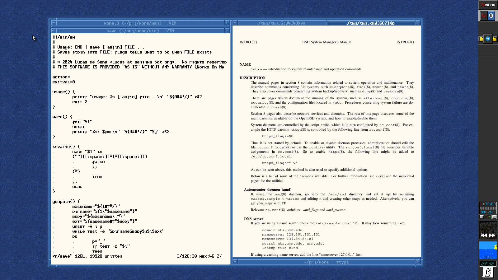

# Dotfiles etc

Read the manual at `./doc/home.8` for more information.

## Theme

Bitmap font is [tadepe](https://github.com/phillbush/tadepe/).  
Cursor is [Simp1e-Adw](https://gitlab.com/cursors/simp1e).  
Color scheme is [tango](https://en.wikipedia.org/wiki/Tango_Desktop_Project#Palette).  
Icons are created by me (plus a few Haiku icons).

## Demo

## See Also

* [paginator](https://github.com/phillbush/paginator).
* [shod](https://github.com/phillbush/shod).
* [wmpdart](https://github.com/phillbush/wmpdart).
* [xfiles](https://github.com/phillbush/xfiles).
* [xmenu](https://github.com/phillbush/xmenu).
* [πmenu](https://github.com/phillbush/pmenu).
