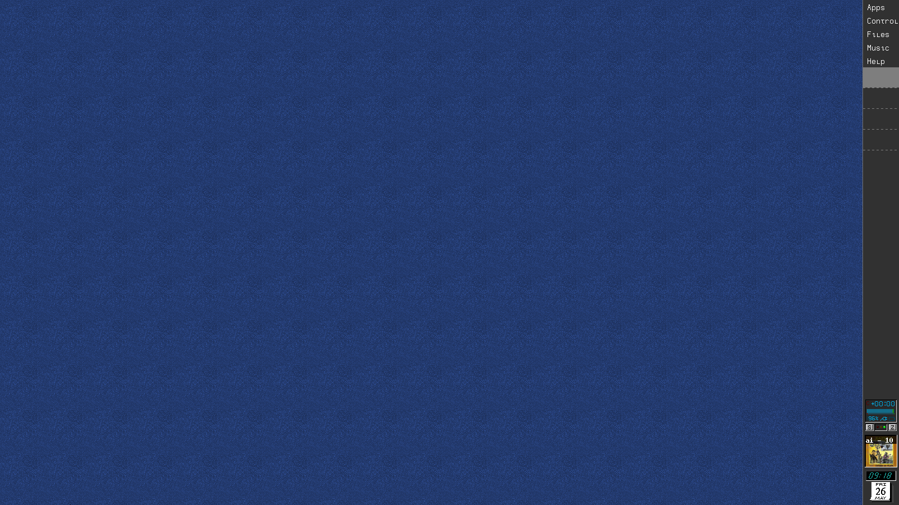
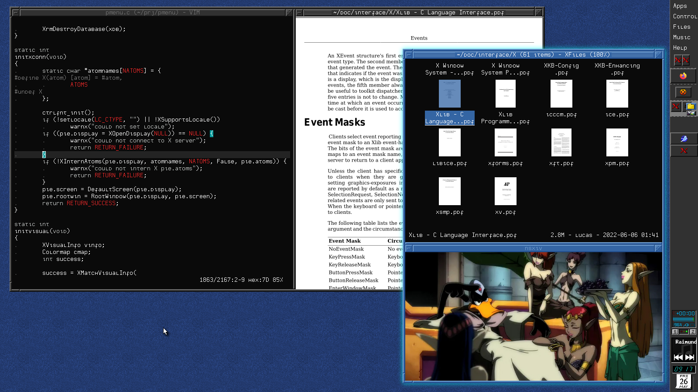
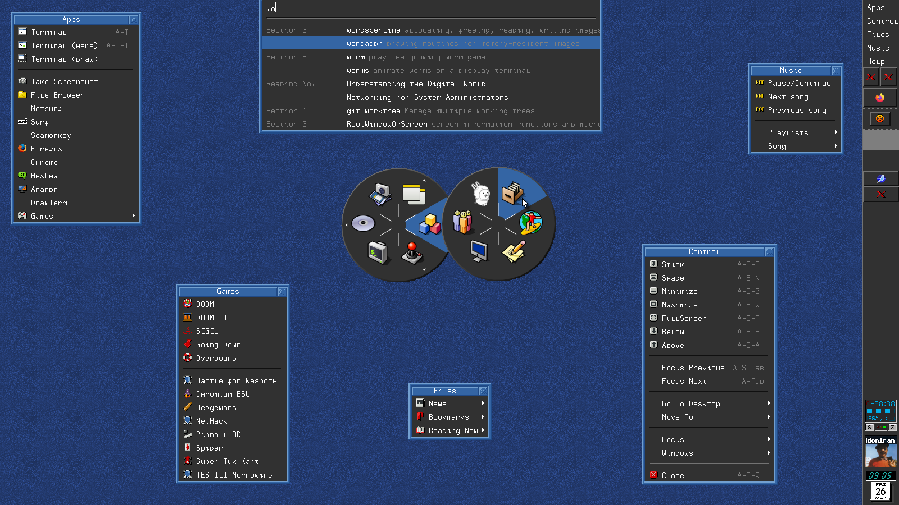

# Dotfiles etc

Read the manual at `./man/home.7` for more information.

## Theme

Bitmap font is [tadepe](https://github.com/phillbush/tadepe/).  
Cursor is [retrosmart](https://github.com/mdomlop/retrosmart-x11-cursors/).  
Color scheme is [tango](https://en.wikipedia.org/wiki/Tango_Desktop_Project#Palette).  
Icons are created by me (plus a few Haiku icons).

## Demo

Clean:

Dirty:

Menus:

## See Also

* [shod](https://github.com/phillbush/shod).
* [fmutils](https://github.com/phillbush/fmutils).
* [wmpdart](https://github.com/phillbush/wmpdart).
* [ctrlmenu](https://github.com/phillbush/ctrlmenu).
* [paginator](https://github.com/phillbush/paginator).

